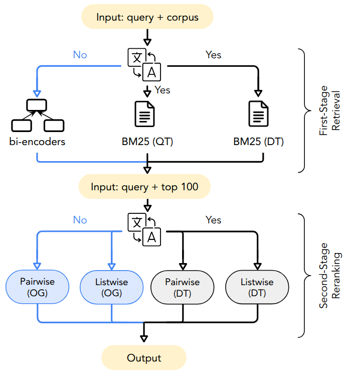

# Evaluating Large Language Models for Cross-Lingual Information Retrieval

<p align="center">
  
</p>


This repository contains the code, experimental framework, evaluation scripts, and ranking results to facilitate reproducibility and future research. 


<!-- ## Installation

Install the required dependencies:

```
pip install -r requirements.txt
```
We recommend using a virtual environment. -->

## Directory Structure

 - `retrieval/`: First-stage retrieval (e.g., BM25)
 - `reranking/`: LLM-based second-stage reranking (listwise & pairwise)
 
## Data Loading
For our work, we evaluated CLEF2003 as a corpus for high-resource European languages, and CIRAL as a corpus for low-resource African languages.

To download CLEF2003, you first need to install [clef-dataloaders](https://github.com/rlitschk/clef-dataloaders). Follow the setup instructions in the repository, and run ```pip install -e .``` inside the directory where you extracted clef-dataloaders.
You can then use ```python download_data.py``` to download both CIRAL and CLEF2003. 
The script preprocesses the data, so the format is compatible with all evaluation code inside this repository. By default, the script downloads both datasets, but you can choose to download only a specific dataset by passing the argumet ```--dataset <clef/ciral>```.
<!-- Make sure to adjust the ```OUT_BASE_DIR``` const, according to the directory where you want to download the data.  -->


You can also manually download the **CIRAL queries/qrels** from [here](https://huggingface.co/datasets/CIRAL/ciral). For queries, we used the ```-test-a.tsv``` files. For the qrels, we used the ```-test-a-pools.tsv``` files. The **CIRAL corpus** files can be downloaded from [here](https://huggingface.co/datasets/CIRAL/ciral-corpus).

## Running Experiments

### 1. Environment Setup

Before running any scripts, you need to configure the `.env` file in the project root with the correct local paths.
All provided scripts automatically load `.env` from the repository root.

### 2. First-stage Retrieval
Refer to [/retrieval/README.md](retrieval/README.md) for generating initial candidates using BM25 or bi-encoder models.

### 3. Second-stage Reranking
You can use either listwise or pairwise reranking.
Refer to [/reranking/README.md](reranking/README.md) for details.

## Evaluation 


Run the provided script `build_score_table.py` to evaluate and build final retrieval or reranking results table.

```
python build_score_table.py \
  --stage <retrieval|reranking> \
  --dataset <clef|ciral> \
  --approach <listwise|pairwise>
```
- `--stage`: Stage of experiments, either `retrieval` or `reranking`
- `--dataset`: Dataset to evaluate, either `clef` or `ciral`
- `--approach`: Reranking method, either `listwise` or `pairwise`. Only required when `--stage=reranking`


After evaluation, a significance test is run automatically, if reranking is significantly different from retrieval (p < 0.05), a * is added after the score.


## Citation

If you find this paper useful, please cite:


